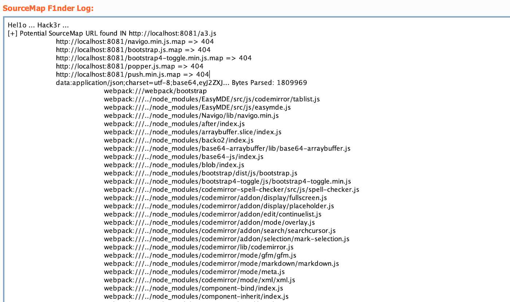
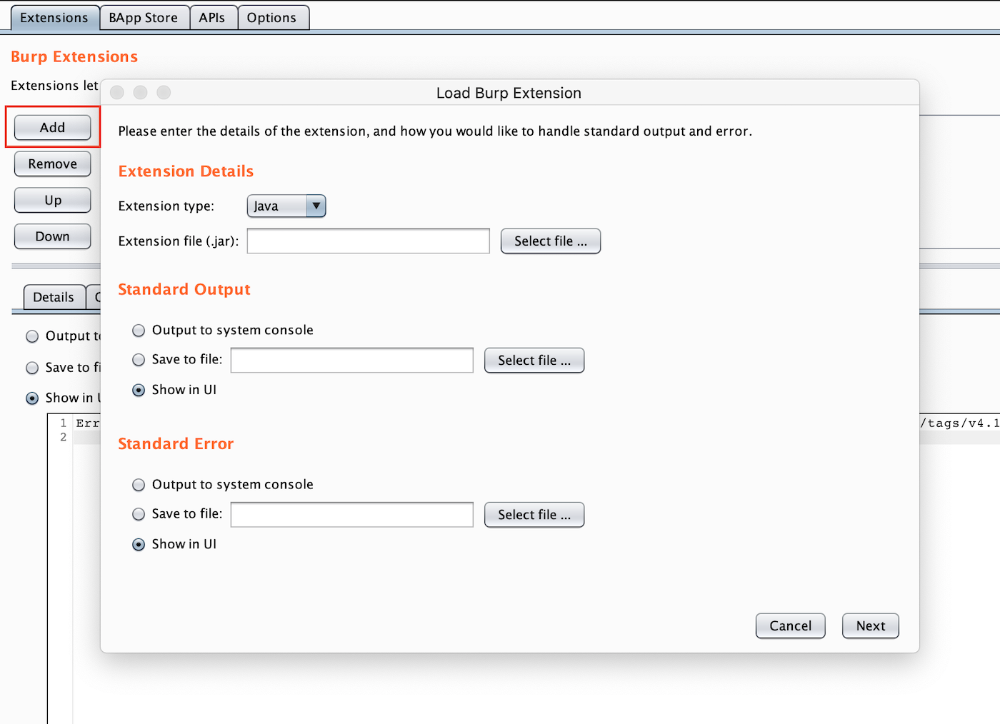
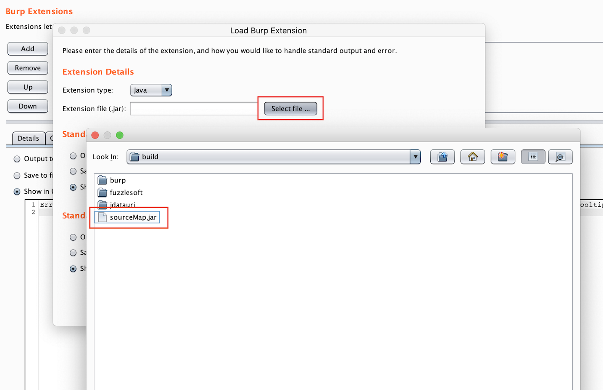
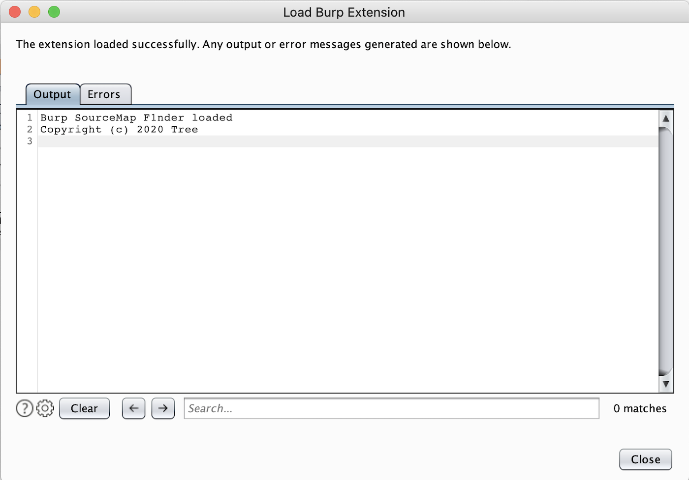

# Source Map F1nder

This extension is for Burp Suite, finding sourceMap when passive/active scanning.

Tested on Burp Pro v2020.9.2


## Google Dork

```
inurl:js filetype:map
```

## Screenshot



## Core Logic

### phase I

Analyze **.js** file line by line. If `//# sourceMappingURL=<Uri>` exist, extracting the `<Uri>`.

Supported `<Uri>`:

1. Absolute URL (http://...)

2. Relative URL (xxx.js.map)

3. Data Uri (data://...)

### phase II

For URL, I will `GET` it first. If status code eq 200, trying to parse the response body as raw JSON.

For Data Uri, which often base64 encoded JSON data, I'll decode it as raw JSON.

### phase III

For the sake of sourceMap is in the form of 
```json
{
    "version": 3,
    "sources": ["file1", "file2", "..."],
    "sourcesContent": ["file1-content", "file2-content", "..."],
    "mappings": "CAAA,SAAA, ...",
}
```

according to [spec.html](https://sourcemaps.info/spec.html).

I display the `sources` part in Burp Tab currently. Any advices are welcome!!!

## Build

```bash
$ chmod +x compile.sh
$ ./compile.sh
$ #output path: build/sourceMap.jar 
```

## Manual Installation Guide

1. Download release sourceMap.jar

2. Switch to Extender Tab, then "Add"



3. Press "select file..." and choose sourceMap.jar



4. select "Next", everything is okay



## External Library

1. https://github.com/mitchhentges/json-parse
2. https://github.com/ooxi/jdatauri
